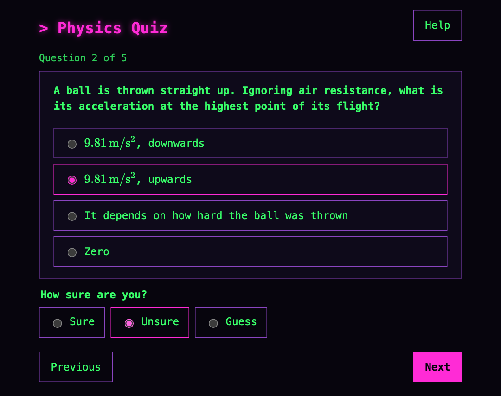
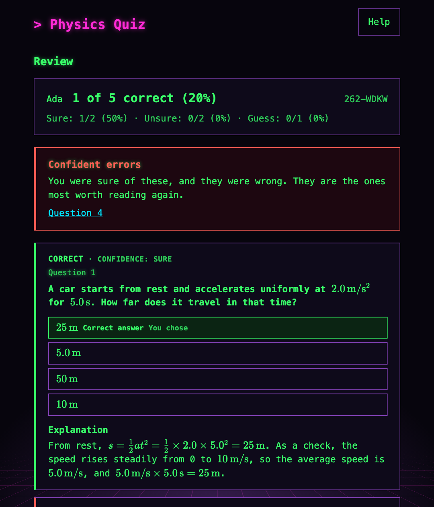

# Physics Quiz

A local-first web app for multiple-choice physics quizzes that teach. A teacher, or an AI assistant, writes a **question bank** as one JSON or YAML file. A participant loads it, answers a random selection of its questions, and then gets a review with the correct answers, the author's explanations, and a note on the mistake behind each wrong answer they chose.

**Live: <https://sortigoza.github.io/phy-quiz-app/>**

<p>
  
  
</p>

- **Maths that renders.** LaTeX through KaTeX, and Markdown, in every question, option and explanation.
- **A review that teaches.** Every question with the correct option and a worked explanation. Answers you were sure of but got wrong come first.
- **Answer first**, if you like: write your own answer before the options appear, then grade yourself against the explanation.
- **History** of every attempt, with accuracy per tag, export and import, and any past review reopened.
- **No server, no account.** Everything stays in the browser. The app installs, and works offline after the first visit.
- **Private banks.** A bank can be published encrypted, and opened only through the link a teacher sends.

## Quickstart

**Take a quiz.** Open the [app](https://sortigoza.github.io/phy-quiz-app/), paste this link into **Load from URL**, and press **Start** on any bank:

```text
https://sortigoza.github.io/phy-quiz-app/examples/physics-course.json
```

That is a bank repository: one link that loads all the example banks, on kinematics, DC circuits, energy and momentum, and quantum mechanics.

**Write a bank.** Copy [`examples/kinematics.json`](./examples/kinematics.json), or the YAML [`examples/energy-and-momentum.yaml`](./examples/energy-and-momentum.yaml), change the questions, and check the file with **Validate a bank** in the app. Then send the file, or put it in a public GitHub repository and send its link. [docs/bank-format.md](./docs/bank-format.md) has every field and rule.

**Have an AI assistant write one.** Give it the prompt in [docs/authoring-with-ai.md](./docs/authoring-with-ai.md), or ask it to read the app's [llms.txt](https://sortigoza.github.io/phy-quiz-app/llms.txt).

**Run it locally.** With Node 20 or later and [pnpm](https://pnpm.io):

```bash
pnpm install
pnpm dev
```

## Documentation

| For | Document |
| --- | --- |
| Teachers | [Writing a question bank](./docs/bank-format.md): every field, examples, the backslash trap, YAML, publishing, private banks, and every error message explained |
| Teachers | [Writing a bank with an AI assistant](./docs/authoring-with-ai.md): a prompt to copy, and how to write good distractors and explanations |
| Anyone hosting a copy | [Deploying](./docs/deploy.md): GitHub Pages, Vercel, Netlify, and S3 with CloudFront |
| Contributors | [Developing](./docs/development.md): setup, scripts, tests, and releasing |
| Everyone | [CONTEXT.md](./CONTEXT.md): the glossary of every term the project uses |
| Contributors | [SPEC.md](./SPEC.md), [PLAN.md](./PLAN.md), [docs/adr](./docs/adr) and [docs/tickets](./docs/tickets/README.md): the specification, architecture, decisions, and the work in slices |

Editors check a bank as it is written against the app's JSON Schema, at [`schema/bank-v1.schema.json`](https://sortigoza.github.io/phy-quiz-app/schema/bank-v1.schema.json), which is generated from the same rules the app validates with.

## Status

Heading for v1.0.0. Loading banks by upload, URL and repository, the quiz and review, confidence, answer-first mode, tags, history with export and import, private banks, and offline install all work. What remains is tracked in [docs/tickets](./docs/tickets/README.md). Share links and a leaderboard are planned for v1.1.

## Licence

MIT. The example banks are CC-BY-4.0.
